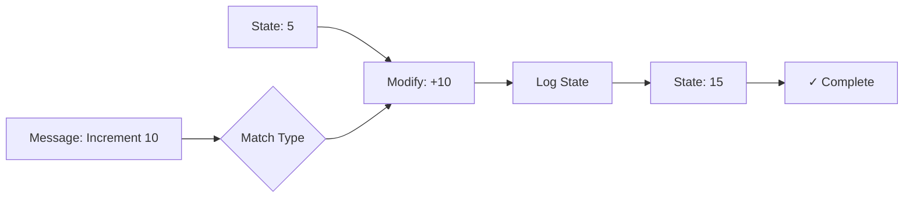

# Building Actors with Effects

## What are Effects?

Think of an **Effect** as a recipe for what your actor should do when it receives a message. Just like a cooking recipe tells you the steps to make a dish, an Effect tells the actor:

1. How to update its state
2. What messages to send to other actors
3. What to log or track
4. How to handle errors

The beauty of Effects is that you can **compose** them - combine simple recipes into complex behaviors, just like combining basic cooking techniques to create elaborate dishes. And now, Effects are **stack-safe**, meaning you can chain thousands of operations without worrying about stack overflow!

### 🚀 Blocking is Safe!

**Coming from Akka or reactive frameworks?** Great news: **You can forget about `CompletableFuture` chains and async/await complexity!**

Cajun runs on **Java 21+ Virtual Threads** (Project Loom), which means:

- ✅ **Write normal blocking code** - Database calls, HTTP requests, file I/O - just write them naturally
- ✅ **No Future/Promise hell** - No `.thenCompose()`, `.thenApply()`, or callback chains
- ✅ **Efficient under the hood** - When you block, only the virtual thread suspends, never the OS thread
- ✅ **Simple imperative style** - Code looks synchronous but executes efficiently

```java
// This is perfectly fine in Cajun! No CompletableFuture needed.
Effect.attempt(() -> {
    // Looks like blocking code, but it's efficient!
    var data = database.query("SELECT * FROM users");  // Blocks the VT, not the OS
    var result = httpClient.get("https://api.example.com");  // Also fine!
    return processData(data, result);
})
.recover(error -> "Fallback value");
```

**The catch?** While blocking is efficient for the system, remember that **actors process one message at a time**. If your actor blocks for 5 seconds waiting for an API call, it won't process the next message until that call finishes. For parallel work, spawn child actors or use the parallel combinators (`parZip`, `parSequence`).

## Your First Effect

Let's build a simple counter to understand the basics. We'll start by defining the messages our counter can receive:

```java
// Define your messages - what can the counter do?
sealed interface CounterMsg {}
record Increment(int amount) implements CounterMsg {}
record GetCount(Pid replyTo) implements CounterMsg {}
```

Now let's create an effect that modifies the counter's state. An effect that increments the counter by 1 looks like this:

```java
// Create an effect that increments the counter
// Effect<State, Error, Result>
//   State: Integer (our counter value)
//   Error: Throwable (what errors might occur)
//   Result: Void (we don't return a value, just modify state)
Effect<Integer, Throwable, Void> incrementEffect =
    Effect.modify(count -> count + 1);
```

That's it! This effect describes a simple operation: "Take the current count and add 1 to it." The beauty is that this is just a description - it won't execute until an actor runs it.

## Building Intuition: Effects are Transformations

Think of your actor's state as a value that flows through a pipeline. Each effect is a transformation in that pipeline:



```java
// Start with state = 5
// Message arrives: Increment(10)

Effect<Integer, Throwable, Void> effect = 
    Effect.modify(count -> count + 10);  // Transform: 5 → 15

// State is now 15
```

## How Effects Run Inside an Actor

Understanding how effects are executed is crucial to using them effectively.

### The Actor-Effect Lifecycle

When you create an actor with an Effect-based behavior, here's what happens:

```java
// 1. You define the effect (the recipe)
Effect<Integer, Throwable, Void> behavior = 
    Effect.<Integer, Throwable, Void, CounterMsg>match()
        .when(Increment.class, (state, msg, ctx) -> 
            Effect.modify(s -> s + msg.amount())
        )
        .build();

// 2. You spawn the actor
Pid counter = fromEffect(system, behavior, 0).spawn();

// 3. You send a message
counter.tell(new Increment(5));
```

**What happens when the message arrives:**

1. **Message Queued**: The message enters the actor's mailbox (a queue)
2. **Actor Wakes Up**: The actor's virtual thread picks up the message
3. **Effect Executes**: The effect runs through its operations in a stack-safe manner, allowing thousands of chained operations without stack overflow
4. **State Updated**: If successful, the actor's state is updated
5. **Next Message**: The actor processes the next message in the mailbox

### Key Insights

**Effects are Lazy Descriptions**

Effects don't execute until the actor runs them. They're just descriptions of what to do.

**One Message at a Time**

Even if 100 messages arrive, the actor processes them sequentially. This is the actor model guarantee.

**Virtual Threads Make Blocking Safe**

When an effect blocks (database call, HTTP request), only the virtual thread suspends, not the OS thread.

## Composing Effects: Chaining Actions

The real power comes from chaining effects together. Use `.andThen()` to say "do this, then do that":

```java
Effect<Integer, Throwable, Void> effect = 
    Effect.modify(count -> count + 10)           // First: add 10
        .andThen(Effect.logState(c -> "Count is now: " + c));  // Then: log it

// When state=5 and Increment arrives:
// 1. State becomes 15
// 2. Logs "Count is now: 15"
```

## Pattern Matching: Handling Different Messages

Real actors need to handle multiple message types. Use `Effect.match()` to route messages.  
**Note**: The Message type is specified at the match level (4th type parameter), not in the Effect type:

```java
// Message type (CounterMsg) is the 4th type parameter in match()
Effect<Integer, Throwable, Void> counterBehavior = 
    Effect.<Integer, Throwable, Void, CounterMsg>match()
        .when(Increment.class, (state, msg, ctx) -> 
            Effect.modify(s -> s + msg.amount())
                .andThen(Effect.logState(s -> "Incremented to: " + s)))
        
        .when(Decrement.class, (state, msg, ctx) ->
            Effect.modify(s -> s - msg.amount())
                .andThen(Effect.logState(s -> "Decremented to: " + s)))
        
        .when(GetCount.class, (state, msg, ctx) ->
            Effect.tell(msg.replyTo(), state))
        
        .build();
```

**What's happening here?**
- When an `Increment` arrives → modify state and log
- When a `Decrement` arrives → modify state and log  
- When a `GetCount` arrives → send current state to the requester

## Understanding the Error Type Parameter

You may have noticed `Throwable` as the second type parameter in `Effect<State, Throwable, Result>`. This is the **Error type** - it tells the Effect what kind of errors it can handle.

### Why Not Just Use Throwable Everywhere?

While `Throwable` works for most cases, you can use **specific exception types** for better type safety:

```java
// Using IOException for file operations
Effect<FileState, IOException, String> readFile = 
    Effect.<FileState, IOException, String>attempt(() -> {
        String content = Files.readString(Path.of("data.txt"));
        return content;
    });

// Using SQLException for database operations  
Effect<DbState, SQLException, ResultSet> queryDb =
    Effect.<DbState, SQLException, ResultSet>attempt(() -> {
        // Your database query code
        return resultSet;
    });

// Using custom checked exceptions
class ValidationException extends Exception {
    ValidationException(String msg) { super(msg); }
}

Effect<OrderState, ValidationException, Void> validateOrder = 
    Effect.<OrderState, ValidationException>modify(state -> {
        if (state.items().isEmpty()) {
            throw new ValidationException("Order cannot be empty");
        }
        return state.withValidated(true);
    }).attempt();
```

### When to Use Specific Exception Types

**Use specific exception types when:**
- You want compile-time guarantees about what errors can occur
- You're integrating with APIs that throw checked exceptions (File I/O, JDBC, etc.)
- You have custom domain-specific exceptions
- You want to handle different error types differently

**Use `Throwable` when:**
- You're handling multiple different exception types
- You want maximum flexibility
- You're just getting started and want simplicity

### Handling Multiple Exception Types

If you need to handle multiple exception types, use their common supertype:

```java
// Both IOException and SQLException extend Exception
Effect<State, Exception, Result> effect = 
    Effect.<State, Exception, Result>attempt(() -> {
        // Code that might throw IOException or SQLException
        String data = Files.readString(Path.of("data.txt"));  // throws IOException
        database.execute(data);  // throws SQLException
        return result;
    });

// Then handle them differently in recovery
Effect<State, Exception, String> handled = effect.handleErrorWith((err, s, m, c) -> {
    if (err instanceof IOException) {
        return Effect.of("IO Error: " + err.getMessage());
    } else if (err instanceof SQLException) {
        return Effect.of("DB Error: " + err.getMessage());
    }
    return Effect.of("Unknown error");
});
```

## Alternative: ThrowableEffect

If you find the type parameters verbose, Cajun also provides **`ThrowableEffect<State, Result>`** - a simpler alternative with only 2 type parameters:

```java
// ThrowableEffect - simpler, always uses Throwable for errors
ThrowableEffect<Integer, Void> increment = 
    ThrowableEffect.modify(count -> count + 1);

// Pattern matching with ThrowableEffect
ThrowableEffect<Integer, Void> behavior = 
    ThrowableEffect.<Integer, CounterMsg>match()
        .when(Increment.class, (state, msg, ctx) -> 
            ThrowableEffect.modify(s -> s + msg.amount()))
        .build();
```

**When to use ThrowableEffect:**
- You always use `Throwable` as your error type
- You want less verbose type signatures
- You're building simple actors

**When to use Effect:**
- You need specific checked exception types
- You want maximum type safety
- You're integrating with APIs that throw checked exceptions

Both `Effect` and `ThrowableEffect` are **stack-safe** and have the same operators. Choose based on your needs!

## Common Effect Patterns

### 1. Modifying State

```java
// Simple increment
Effect.modify(count -> count + 1)

// Update based on message
Effect.modify(count -> count + msg.amount())

// Set to specific value
Effect.setState(0)  // Reset to zero
```

### 2. Sending Messages

```java
// Send to another actor
Effect.tell(otherActor, new SomeMessage())

// Send to yourself (useful for scheduling)
Effect.tellSelf(new ProcessNext())

// Reply to sender
Effect.tell(msg.replyTo(), result)
```

### 3. Logging

```java
// Simple log message
Effect.log("Processing started")

// Log with current state
Effect.logState(count -> "Current count: " + count)

// Log errors
Effect.logError("Something went wrong")
```

### 4. Combining Multiple Actions

```java
// Do several things in sequence
Effect.modify(count -> count + 1)
    .andThen(Effect.logState(c -> "Count: " + c))
    .andThen(Effect.tell(monitor, new CountUpdate(count)))
```

## Working with Results

Sometimes you want to produce a value, not just change state:

```java
// Produce a value
Effect<Integer, Msg, String> effect = Effect.of("Hello");

// Transform a value
Effect<Integer, Msg, Integer> getCount = Effect.state();
Effect<Integer, Msg, String> formatted = 
    getCount.map(count -> "Count is: " + count);
```

## Error Handling Made Simple

Effects make error handling explicit and composable:

```java
// Try something risky
Effect<Integer, Msg, String> risky = 
    Effect.attempt(() -> riskyOperation());

// Handle errors gracefully
Effect<Integer, Msg, String> safe = risky
    .recover(error -> "Error: " + error.getMessage());

// Or provide a fallback effect
Effect<Integer, Msg, String> withFallback = risky
    .orElse(Effect.of("default value"));
```

## Validation and Filtering

Check conditions and handle invalid cases:

```java
// Define a custom validation error
record ValidationError(String field, Object value, String reason) extends Exception {
    ValidationError(String field, Object value, String reason) {
        super(String.format("%s: %s (got: %s)", field, reason, value));
    }
}

Effect<Integer, ValidationError, Integer> validated = 
    Effect.of(value)
        .filter(v -> v > 0, 
                v -> new ValidationError("amount", v, "must be positive"))
        .recover(error -> {
            ctx.getLogger().error("Validation failed: " + error.getMessage());
            return 0;
        });
```

## Creating Actors from Effects

Once you've built your effect, turn it into an actor:

```java
import static com.cajunsystems.functional.ActorSystemEffectExtensions.*;

// Create the effect
Effect<Integer, Throwable, Void> counterEffect = 
    Effect.<Integer, Throwable, Void, CounterMsg>match()
    .when(Increment.class, (state, msg, ctx) -> 
        Effect.modify(s -> s + msg.amount()))
    .when(GetCount.class, (state, msg, ctx) ->
        Effect.tell(msg.replyTo(), state))
    .build();

// Spawn an actor with this behavior
Pid counter = fromEffect(system, counterEffect, 0)  // Start with state = 0
    .withId("my-counter")
    .spawn();

// Use it like any actor
counter.tell(new Increment(5));
```

## Real-World Example: Shopping Cart

Let's build a shopping cart actor using effects:

```java
// Messages
sealed interface CartMsg {}
record AddItem(String item, double price) implements CartMsg {}
record RemoveItem(String item) implements CartMsg {}
record GetTotal(Pid replyTo) implements CartMsg {}
record Checkout(Pid replyTo) implements CartMsg {}

// State
record CartState(Map<String, Double> items, double total) {
    CartState() {
        this(new HashMap<>(), 0.0);
    }
}

// Build the behavior
Effect<CartState, Throwable, Void> cartBehavior =
    Effect.<CartState, Throwable, Void, CartMsg>match()
    .when(AddItem.class, (state, msg, ctx) ->
        Effect.modify(s -> {
            // Create a new map with the added item
            var newItems = new HashMap<>(s.items());
            newItems.put(msg.item(), msg.price());
            return new CartState(newItems, s.total() + msg.price());
        })
        .andThen(Effect.logState(s -> "Cart total: $" + s.total())))

    .when(RemoveItem.class, (state, msg, ctx) ->
        Effect.modify(s -> {
            // Create a new map with the item removed
            var newItems = new HashMap<>(s.items());
            Double price = newItems.remove(msg.item());
            if (price != null) {
                return new CartState(newItems, s.total() - price);
            }
            return s;
        }))
    
    .when(GetTotal.class, (state, msg, ctx) ->
        Effect.tell(msg.replyTo(), state.total()))
    
    .when(Checkout.class, (state, msg, ctx) ->
        Effect.of(state.total())
            .filter(total -> total > 0, 
                    total -> new IllegalStateException("Cart is empty, total: " + total))
            .flatMap(total -> 
                Effect.tell(paymentService, new ProcessPayment(total))
                    .andThen(Effect.setState(new CartState()))
                    .andThen(Effect.tell(msg.replyTo(), "Checkout successful")))
            .recover(error -> {
                ctx.tell(msg.replyTo(), "Checkout failed: " + error.getMessage());
                return null;
            }))
    
    .build();

// Create the cart actor
Pid cart = fromEffect(system, cartBehavior, new CartState())
    .withId("shopping-cart")
    .spawn();
```

**Note on Mutability:** Since actors process one message at a time, mutations within `Effect.modify` are safe—there's no concurrency risk. You could directly mutate the state's map and return it. However, **immutable data structures are still encouraged** as a best practice because they:
- Make state transitions more predictable and easier to reason about
- Prevent accidental bugs from shared references
- Make testing and debugging simpler
- Align with functional programming principles

Feel free to mutate within your handlers, but creating new collections (as shown above) is generally cleaner and safer.

### Recommended Immutable Data Structure Libraries

If you want to embrace immutability fully, consider using one of these excellent libraries:

#### 1. Vavr (Recommended for Functional Programming)

**Vavr** provides persistent immutable collections with structural sharing, making updates efficient:

```java
// Add to your pom.xml or build.gradle
// io.vavr:vavr:0.10.4

import io.vavr.collection.HashMap;
import io.vavr.collection.Map;

record CartState(Map<String, Double> items, double total) {
    CartState() {
        this(HashMap.empty(), 0.0);
    }
}

Effect.modify(s -> {
    // Vavr collections are immutable - put() returns a new map
    var newItems = s.items().put(msg.item(), msg.price());
    return new CartState(newItems, s.total() + msg.price());
})
```

**Why Vavr?**
- Persistent data structures with structural sharing (O(log n) updates)
- Rich functional API (map, filter, fold, etc.)
- Pattern matching support
- Tuples, Option, Try, and other functional types

#### 2. Google Guava (Simple and Widely Used)

**Guava** provides straightforward immutable collections:

```java
// Add to your pom.xml or build.gradle
// com.google.guava:guava:33.0.0-jre

import com.google.common.collect.ImmutableMap;

record CartState(ImmutableMap<String, Double> items, double total) {
    CartState() {
        this(ImmutableMap.of(), 0.0);
    }
}

Effect.modify(s -> {
    // Create new immutable map with added entry
    var newItems = ImmutableMap.<String, Double>builder()
        .putAll(s.items())
        .put(msg.item(), msg.price())
        .build();
    return new CartState(newItems, s.total() + msg.price());
})
```

**Why Guava?**
- Simple, well-documented API
- Widely adopted in industry
- Good for teams already using Guava

#### 3. PCollections (Pure Persistent Collections)

**PCollections** offers persistent collections with minimal dependencies:

```java
// Add to your pom.xml or build.gradle
// org.pcollections:pcollections:4.0.2

import org.pcollections.HashTreePMap;
import org.pcollections.PMap;

record CartState(PMap<String, Double> items, double total) {
    CartState() {
        this(HashTreePMap.empty(), 0.0);
    }
}

Effect.modify(s -> {
    // plus() returns a new map with the added entry
    var newItems = s.items().plus(msg.item(), msg.price());
    return new CartState(newItems, s.total() + msg.price());
})
```

**Why PCollections?**
- Lightweight library focused solely on persistent collections
- Good performance with structural sharing
- Minimal dependencies

#### 4. Java Built-in (Java 9+)

For simple cases, use Java's built-in immutable factories:

```java
record CartState(Map<String, Double> items, double total) {
    CartState() {
        this(Map.of(), 0.0);
    }
}

Effect.modify(s -> {
    // Create new map by copying + adding
    var newItems = new HashMap<>(s.items());
    newItems.put(msg.item(), msg.price());
    return new CartState(Map.copyOf(newItems), s.total() + msg.price());
})
```

**Why Java Built-in?**
- No external dependencies
- Good for simple use cases
- Part of the standard library

**Note:** Java's `Map.of()` and `Map.copyOf()` create truly immutable maps but don't use structural sharing, so they copy the entire collection on each "update." For frequently updated state, consider Vavr or PCollections.

### Which Should You Choose?

| Library | Best For | Performance | Learning Curve |
|---------|----------|-------------|----------------|
| **Vavr** | Functional programming enthusiasts, complex state | Excellent (structural sharing) | Moderate |
| **Guava** | Teams already using Guava, simple immutability | Good | Low |
| **PCollections** | Lightweight persistent collections | Excellent (structural sharing) | Low |
| **Java Built-in** | Simple state, no dependencies | Fair (full copies) | Very Low |

For most actor-based applications with Cajun, we recommend **Vavr** for its excellent performance and functional API, or **PCollections** if you prefer a lightweight option.

## Building Intuition: The Mental Model

Think of Effects like building blocks:

1. **Simple blocks** - Basic operations like `modify`, `log`, `tell`
2. **Combining blocks** - Use `andThen` to chain operations
3. **Branching blocks** - Use `match` to handle different cases
4. **Error-safe blocks** - Use `recover` and `orElse` for safety
5. **Transforming blocks** - Use `map` and `flatMap` to transform values

The key insight: **You're describing what should happen, not manually doing it**. The Effect system handles the execution, state management, and error propagation for you.

## Common Patterns

### Pattern 1: Validate, Process, Notify

```java
Effect.of(input)
    .filter(i -> i.isValid(), 
            i -> new ValidationException("Input validation failed: " + i))
    .map(i -> i.process())
    .flatMap(result -> 
        Effect.modify(s -> s.update(result))
            .andThen(Effect.tell(monitor, new ProcessComplete(result))))
    .recover(error -> {
        ctx.getLogger().error("Processing failed", error);
        return null;
    })
```

### Pattern 2: Ask Another Actor, Then Update

```java
Effect.ask(inventoryActor, new CheckStock(item), Duration.ofSeconds(5))
    .flatMap(inStock -> {
        if (inStock) {
            return Effect.modify(s -> s.addItem(item))
                .andThen(Effect.log("Item added"));
        } else {
            return Effect.log("Out of stock");
        }
    })
    .recover(error -> {
        ctx.getLogger().error("Inventory check failed", error);
        return null;
    })
```

### Pattern 3: Conditional Logic

```java
Effect.when(
    msg -> msg.priority() == Priority.HIGH,
    Effect.modify(s -> s.processImmediately(msg))
        .andThen(Effect.log("High priority processed")),
    Effect.tellSelf(msg)  // Requeue for later
        .andThen(Effect.log("Queued for later"))
)
```

## Best Practices for Virtual Threads

### ✅ DO: Write Simple Blocking Code

```java
// This is the Cajun way - simple and efficient!
Effect.attempt(() -> {
    var user = database.findUser(userId);        // Blocking call - totally fine!
    var orders = orderService.getOrders(userId); // Another blocking call - great!
    return new UserProfile(user, orders);
})
.recover(error -> UserProfile.empty());
```

### ⚠️ AVOID: synchronized Blocks

**Important:** `synchronized` blocks can pin virtual threads to OS threads, defeating the purpose of Virtual Threads.

```java
// ❌ BAD - synchronized pins the virtual thread
Effect.attempt(() -> {
    synchronized(lock) {  // This pins the VT to the carrier thread!
        return sharedResource.read();
    }
})

// ✅ GOOD - Use ReentrantLock instead
Effect.attempt(() -> {
    lock.lock();  // ReentrantLock is VT-friendly
    try {
        return sharedResource.read();
    } finally {
        lock.unlock();
    }
})
```

### 🎯 Understanding Effect.ask

`Effect.ask` is a **suspension point** - it looks synchronous but executes efficiently:

```java
Effect.ask(inventoryActor, new CheckStock(item), Duration.ofSeconds(5))
    .flatMap(inStock -> {
        // When the runtime encounters ask, it suspends this actor's virtual thread
        // until the reply arrives. The code looks synchronous, but the execution
        // is non-blocking - the OS thread is free to do other work!
        
        if (inStock) {
            return Effect.tell(orderActor, new CreateOrder(item));
        } else {
            return Effect.log("Out of stock: " + item);
        }
    });
```

**Remember:** While the OS thread isn't blocked, **this specific actor** won't process its next message until the reply arrives. If you need this actor to remain responsive, consider:
- Using a child actor to handle the slow operation
- Using `parZip` to do multiple asks in parallel
- Setting appropriate timeouts

### 💡 Parallel Operations

When you need an actor to do multiple things at once:

```java
// ✅ Parallel asks - both happen simultaneously
Effect.ask(service1, request1, timeout)
    .parZip(Effect.ask(service2, request2, timeout), (r1, r2) -> 
        combineResults(r1, r2)
    );

// ✅ Spawn a child actor for long-running work (use context)
Effect.attempt(() -> {
    Pid worker = fromEffect(ctx.system(), workerBehavior, initialState).spawn();
    return worker;
}).flatMap(worker -> Effect.tell(worker, new DoWork(data)));
```

## Failure Semantics

Understanding how errors propagate through effects is critical for building reliable actors.

### Error Propagation Table

| Scenario | What Happens | State | Example |
|----------|--------------|-------|---------|
| **Exception in `map`** | Effect fails, error captured | State preserved | `Effect.of(5).map(x -> x / 0)` → Failure |
| **Exception in `flatMap`** | Effect fails, error captured | State preserved | `Effect.of(5).flatMap(x -> throw ex)` → Failure |
| **Timeout in `ask`** | TimeoutException, effect fails | State preserved | `Effect.ask(pid, msg, 1ms)` → Failure after timeout |
| **NPE in finalizer (`ensure`)** | Original result preserved, NPE logged | Finalizer's state used | Effect completes, NPE in cleanup |
| **Exception in `recover`** | New exception replaces original | State from recover | Recovery handler itself fails |
| **Exception in `bracket` acquire** | Effect fails immediately | Original state | Resource never acquired |
| **Exception in `bracket` use** | Release runs, use failure preserved | Release's state | Resource cleaned up, error propagated |
| **Exception in `bracket` release** | Use result preserved, release error logged | Best effort state | Cleanup failed but use succeeded |
| **Defect in user code** | Uncaught exception, actor may restart | Depends on supervisor | Programmer error, not recoverable |
| **InterruptedException** | Effect fails, interrupt flag restored | State preserved | Thread interrupted during blocking |

### Error Recovery Strategies

```java
// 1. Simple recovery with fallback value
Effect.attempt(() -> riskyOperation())
    .recover(error -> fallbackValue);

// 2. Recover with different effect
Effect.attempt(() -> primaryService.call())
    .recoverWith(error -> Effect.attempt(() -> backupService.call()));

// 3. Retry with exponential backoff
Effect.attempt(() -> unreliableService.call())
    .retry(maxAttempts = 3, initialDelay = Duration.ofMillis(100));

// 4. Handle specific errors
Effect.attempt(() -> operation())
    .handleErrorWith(error -> {
        if (error instanceof TimeoutException) {
            return Effect.log("Timeout, using cache");
        } else {
            return Effect.fail(error);  // Re-throw
        }
    });
```

### Defects vs Errors

**Errors** (Expected): Timeouts, validation failures, network errors
- Represented in the error channel (`E` type parameter)
- Recoverable with `recover`, `recoverWith`, `handleError`

**Defects** (Unexpected): NullPointerException, ClassCastException, OutOfMemoryError
- Programming bugs, not business logic failures
- May cause actor restart depending on supervisor strategy
- Should be fixed in code, not caught and recovered

## Handling Interruptions and Cancellation

When an actor is stopped (either by a supervisor or explicitly), its virtual thread is interrupted. Effects provide operators to handle this gracefully and prevent "zombie" tasks.

### Why Interruption Handling Matters

Without proper interruption handling, long-running effects can:
- Continue consuming resources after the actor is stopped
- Hold database connections, file handles, or network sockets
- Prevent clean shutdown of your application

### onInterrupt() - Cleanup on Cancellation

Use `onInterrupt()` to register cleanup code that runs when the effect is interrupted:

```java
// Database query with cleanup
Effect.attempt(() -> database.longRunningQuery())
    .onInterrupt(() -> {
        database.rollback();
        connectionPool.returnConnection(conn);
        logger.info("Query cancelled, connection returned");
    });

// File processing with cleanup
Effect.attempt(() -> processLargeFile(inputStream))
    .onInterrupt(() -> {
        inputStream.close();
        Files.deleteIfExists(tempFile);
    });
```

### Cooperative Cancellation with checkInterrupted()

For long-running computations, check for interruption periodically:

```java
Effect.attempt(() -> {
    List<Result> results = new ArrayList<>();
    for (Item item : largeDataset) {
        // Check if actor was stopped
        if (Thread.interrupted()) {
            throw new InterruptedException("Processing cancelled");
        }
        results.add(processItem(item));
    }
    return results;
});
```

### Real-World Example: HTTP Client with Timeout

```java
.when(FetchData.class, (state, msg, ctx) -> {
    return Effect.attempt(() -> {
        // This might take a long time
        return httpClient.get(msg.url());
    })
    .withTimeout(Duration.ofSeconds(30))  // Cancel after 30s
    .onInterrupt(() -> {
        httpClient.cancel();  // Cancel the HTTP request
        metrics.recordCancellation("http_fetch");
    })
    .recover(error -> {
        if (error instanceof TimeoutException) {
            ctx.getLogger().warn("Request timed out: {}", msg.url());
            return CachedData.get(msg.url());
        }
        throw error;
    });
})
```

### Integration with Actor Lifecycle

When an actor is stopped:
1. The actor's virtual thread is interrupted
2. Any running effect catches `InterruptedException`
3. `onInterrupt()` cleanup effects execute
4. Resources are properly released
5. The actor terminates cleanly

```java
// Actor with long-running effect
Pid worker = fromEffect(system, behavior, initialState)
    .withId("worker")
    .spawn();

// Later, when stopping the actor
system.stopActor(worker);
// The running effect will be interrupted and cleanup will run
```

### Best Practices

**✅ DO:**
- Use `onInterrupt()` for database connections, file handles, and network resources
- Check `Thread.interrupted()` in long-running loops
- Keep cleanup code simple and fast
- Log interruptions for debugging

**❌ DON'T:**
- Ignore `InterruptedException` - always handle it
- Perform long operations in cleanup code
- Swallow interruption status without re-throwing
- Assume effects will always complete

## Effects in Supervision Trees

Understanding how effects interact with actor supervision is crucial for building fault-tolerant systems.

### How Supervision Works with Effects

When an effect-based actor fails, the supervisor's strategy determines what happens:

```java
// Define supervisor strategy
SupervisorStrategy strategy = SupervisorStrategy.builder()
    .withMaxRetries(3)
    .withWithinTimeRange(Duration.ofMinutes(1))
    .withDecider(error -> {
        if (error instanceof ValidationException) {
            return SupervisorDirective.RESUME;  // Continue with current state
        } else if (error instanceof TransientException) {
            return SupervisorDirective.RESTART;  // Restart with initial state
        } else {
            return SupervisorDirective.STOP;  // Stop the actor
        }
    })
    .build();

// Spawn actor with supervision
Pid actor = fromEffect(system, behavior, initialState)
    .withSupervisorStrategy(strategy)
    .spawn();
```

### Supervisor Directives and Effect Behavior

| Directive | What Happens | State | Effect Execution |
|-----------|--------------|-------|------------------|
| **RESUME** | Actor continues | State preserved | Next message processed |
| **RESTART** | Actor restarts | Reset to initial state | Current effect abandoned, mailbox preserved |
| **STOP** | Actor stops | N/A | Actor terminated, mailbox cleared |
| **ESCALATE** | Supervisor's supervisor decides | Depends on parent | Failure propagated up |

### Effect Failure Scenarios

**1. Handled Errors (Recovered)**
```java
Effect.attempt(() -> riskyOperation())
    .recover(error -> fallbackValue);

// Error is caught and recovered - supervisor never sees it
// Actor continues normally
```

**2. Unhandled Errors (Propagated)**
```java
Effect.attempt(() -> riskyOperation());
// No recovery - error propagates to EffectResult.Failure

// Supervisor's decider function is invoked
// Directive determines actor's fate
```

**3. Defects (Uncaught Exceptions)**
```java
Effect.modify(s -> {
    String value = null;
    return value.length();  // NullPointerException!
});

// Uncaught exception escapes effect system
// Supervisor catches it and applies strategy
```

### State Preservation Patterns

**Pattern 1: Preserve State on Transient Failures**
```java
SupervisorStrategy.builder()
    .withDecider(error -> {
        if (error instanceof NetworkException) {
            return SupervisorDirective.RESUME;  // Keep state, retry later
        }
        return SupervisorDirective.RESTART;
    })
    .build();
```

**Pattern 2: Reset State on Corruption**
```java
SupervisorStrategy.builder()
    .withDecider(error -> {
        if (error instanceof StateCorruptedException) {
            return SupervisorDirective.RESTART;  // Fresh start
        }
        return SupervisorDirective.RESUME;
    })
    .build();
```

**Pattern 3: Graceful Degradation**
```java
Effect.attempt(() -> primaryService.call())
    .recoverWith(error -> {
        // Try fallback before failing
        return Effect.attempt(() -> fallbackService.call());
    })
    .recover(error -> {
        // Last resort: return cached value
        return cachedValue;
    });

// Supervisor only sees failure if all recovery attempts fail
```

### Child Actor Supervision

When an effect spawns child actors, failures can propagate:

```java
Effect.attempt(() -> {
    // Spawn child actor
    Pid child = fromEffect(ctx.system(), childBehavior, childState)
        .withSupervisorStrategy(childStrategy)
        .spawn();
    return child;
})
.flatMap(child -> {
    // Send work to child
    return Effect.ask(child, new DoWork(data), timeout);
})
.recover(error -> {
    // Handle child failure
    if (error instanceof TimeoutException) {
        return Effect.log("Child timed out, using default");
    }
    return Effect.fail(error);  // Escalate to parent supervisor
});
```

### Best Practices

**1. Use Recovery for Expected Failures**
```java
// Good: Handle expected errors in effects
Effect.attempt(() -> parseJson(input))
    .recover(error -> defaultConfig);
```

**2. Let Supervisor Handle Defects**
```java
// Good: Let programming errors bubble up
Effect.modify(s -> s.processData());
// If processData() has a bug, supervisor will restart
```

**3. Design for Restartability**
```java
// Good: Initial state is always valid
record State(Map<String, Value> cache, int requestCount) {
    static State initial() {
        return new State(new HashMap<>(), 0);
    }
}

// Actor can restart cleanly to initial state
```

**4. Avoid Shared Mutable State**
```java
// Bad: Shared mutable state survives restarts
static Map<String, Value> globalCache = new HashMap<>();

// Good: State is immutable and local to actor
record State(Map<String, Value> cache) {
    State withValue(String key, Value value) {
        var newCache = new HashMap<>(cache);
        newCache.put(key, value);
        return new State(newCache);
    }
}
```

**5. Use Circuit Breaker Pattern for External Services**
```java
Effect.attempt(() -> externalService.call())
    .retry(maxAttempts = 3, initialDelay = Duration.ofMillis(100))
    .recover(error -> {
        // After retries exhausted, use fallback
        return cachedResponse;
    });

// Prevents supervisor from restarting actor repeatedly
```

### Supervision Tree Example

```java
// Parent actor supervises multiple children
Effect.<State, Throwable, Void, ParentMsg>match()
    .when(StartWorkers.class, (state, msg, ctx) -> {
        // Spawn supervised workers
        List<Pid> workers = IntStream.range(0, 5)
            .mapToObj(i -> fromEffect(ctx.system(), workerBehavior, WorkerState.initial())
                .withSupervisorStrategy(workerStrategy)
                .spawn())
            .toList();
        
        return Effect.modify(s -> s.withWorkers(workers));
    })
    .when(WorkFailed.class, (state, msg, ctx) -> {
        // Worker failure notification
        // Parent can decide to redistribute work or escalate
        return Effect.log("Worker " + msg.workerId() + " failed, redistributing work");
    })
    .build();
```

### Key Takeaways

1. **Effects don't change supervision** - Standard actor supervision applies
2. **Recover in effects** - Handle expected errors before they reach supervisor
3. **Let supervisor handle defects** - Programming bugs should trigger restarts
4. **Design for restarts** - Initial state should always be valid
5. **Use immutable state** - Makes restarts predictable and safe
6. **Circuit breakers** - Prevent cascading failures in supervision trees

## Cancellation Semantics

Effects in Cajun do not have built-in cancellation support. Here's why and what to do instead:

### Why No Cancellation?

1. **Actor Model**: Actors process one message at a time. You can't "cancel" a message that's being processed.
2. **Virtual Threads**: Interrupting virtual threads is safe, but effects complete quickly in practice.
3. **Simplicity**: Cancellation adds significant complexity to the effect system.

### Alternatives to Cancellation

**1. Use Timeouts**
```java
Effect.ask(slowService, request, Duration.ofSeconds(5))
    .recover(error -> defaultValue);  // Timeout after 5 seconds
```

**2. Use `race` for Competitive Execution**
```java
Effect.ask(service1, request, timeout)
    .race(Effect.ask(service2, request, timeout));  // First to complete wins
```

**3. Stop the Actor**
```java
// If you need to cancel ongoing work, stop the actor
system.stop(actorPid);
```

**4. Use Interruption for Blocking Operations**
```java
Effect.attempt(() -> {
    // This will respect thread interruption
    Thread.sleep(Duration.ofMinutes(10));
    return result;
});

// From outside: interrupt the actor's thread (advanced)
// Note: This is rarely needed and should be used carefully
```

### What About Long-Running Operations?

If an effect takes a long time:
- **Spawn a child actor** to handle it
- **Use `parZip`** to do other work in parallel
- **Set appropriate timeouts** on `ask` operations
- **Break work into smaller messages** that can be processed incrementally

## Evaluation Strategy

Understanding when effects execute is important for reasoning about your code.

### Lazy Construction, Eager Execution

**Construction is Lazy**
```java
// This doesn't execute anything - it's just building a description
Effect<Int, Throwable, String> effect = 
    Effect.modify(s -> s + 1)
        .andThen(Effect.log("Modified!"))
        .map(v -> v.toString());

// Still nothing has happened!
```

**Execution is Eager**
```java
// When the actor runs the effect, it executes immediately
EffectResult<Int, String> result = effect.run(state, message, context);

// The trampoline ensures stack safety, but execution is eager:
// 1. modify runs
// 2. log runs
// 3. map runs
// All happen immediately, in sequence
```

### Key Points

1. **Effects are values** - You can store them, pass them around, compose them
2. **Composition is lazy** - Chaining effects doesn't execute them
3. **Execution is eager** - Once `run()` is called, the effect runs to completion
4. **Trampolining is transparent** - Stack safety doesn't change eager semantics

### Suspended Computations

Use `suspend` or `attempt` for truly lazy evaluation:

```java
// This lambda won't execute until the effect runs
Effect.suspend(() -> {
    System.out.println("This prints when effect runs, not when created");
    return expensiveComputation();
});

// Compare to:
var value = expensiveComputation();  // Runs immediately!
Effect.of(value);  // Effect just wraps the already-computed value
```

### Parallel Execution

Parallel combinators execute eagerly but concurrently:

```java
// Both effects start immediately when run, execute in parallel
Effect.ask(service1, req1, timeout)
    .parZip(Effect.ask(service2, req2, timeout), (r1, r2) -> combine(r1, r2));
```

## Tips for Beginners

1. **Start Simple** - Begin with basic `modify` and `log` effects
2. **Chain Gradually** - Add one `andThen` at a time
3. **Test Each Piece** - Effects are easy to test in isolation
4. **Use Pattern Matching** - It makes message handling clear
5. **Handle Errors** - Always add `.recover()` for risky operations
6. **Think in Pipelines** - Data flows through transformations
7. **Embrace Blocking** - Write natural blocking code, Virtual Threads handle the rest
8. **Avoid synchronized** - Use `ReentrantLock` if you need locks

## Next Steps

- Read the [Full Effect API Reference](api) for all available operations
- See the examples in the Cajun repository for complete working code

## Quick Reference

```java
// State operations
Effect.modify(s -> s + 1)           // Update state
Effect.setState(newState)           // Replace state
Effect.state()                      // Get current state

// Messaging
Effect.tell(actor, msg)             // Send message
Effect.tellSelf(msg)                // Send to self
Effect.ask(actor, msg, timeout)     // Request-response

// Logging
Effect.log("message")               // Log message
Effect.logState(s -> "State: " + s) // Log with state
Effect.logError("error")            // Log error

// Composition
effect1.andThen(effect2)            // Do both in sequence
effect.map(v -> transform(v))       // Transform result
effect.flatMap(v -> nextEffect)     // Chain effects

// Error handling
effect.recover(e -> defaultValue)   // Handle errors
effect.orElse(fallbackEffect)       // Fallback effect
Effect.attempt(() -> risky())       // Try risky operation

// Pattern matching
Effect.<State, Error, Result, Message>match()
    .when(Type1.class, handler1)
    .when(Type2.class, handler2)
    .otherwise(defaultHandler)
    .build()
```

Remember: Effects are just descriptions of what to do. They don't execute until the actor runs them. This makes them easy to test, compose, and reason about!

## Learn More

- **[Effect API Reference](api)** - Complete API documentation with all operators
- Check the Cajun repository for examples and advanced patterns
